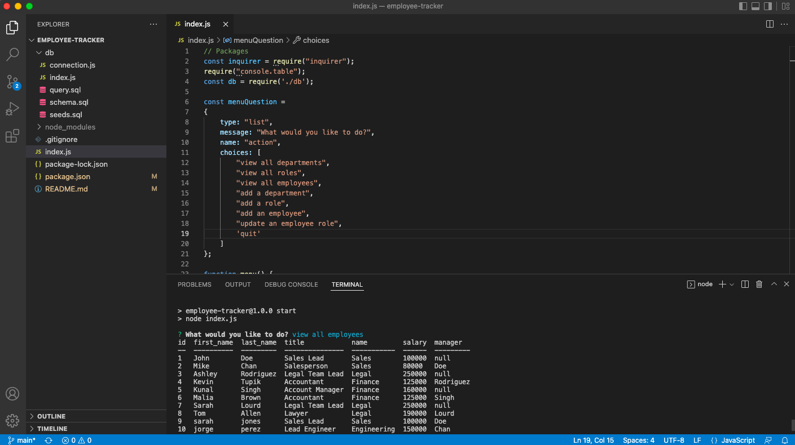

# Employee Tracker
  

## Description
This is a command line application that uses Inquirer to allow manipulation of employee data stored in a MYSQL database. The user (meant to be a business owner or manager) is presented with a menu asking them what task they would like to perform. They have the options to view all departments, roles, or employees; add a new department or role; create a new employee or update an employee's role.

These menu options allow the user to choose to either view, create, or update data. However there is no functionality for deleting data just yet. Some of these questions ask for the user to input raw data while other questions present a list of choices of data that already exists in the database to reduce user error and to implement ease in this application.

## Table of Contents
- [Installation](#installation)
- [Usage](#usage)
- [License](#license)
- [Contributing](#contributing)
- [Tests](#tests)
- [Questions](#questions)
- [Visuals](#visuals)

## Installation

To install this application you should first clone this repository. Then run npm i in the integrated terminal to install the necessary dependencies. If you wish, you may change the name of your database. If you do this you will need to make updates to both the connection.js and the schema.sql files. You will likely also need to update your user info in the connection.js page. Once these files are set up to your liking you should return to the integrated terminal and run the command `mysql -u root -p` to log in to your mysql shell. This will prompt you to enter your password. Next, you will set up your database by running `source schema.sql`. This will drop or delete a database that already exists. So only do this upon inital database set up or if you fire your whole staff because all data will be lost. You may also run `source seeds.sql` to implement my sample data. Alternately you may update that file directly to hardcode some of your employees directly. However to experience full functionality of this application, I recommend escaping the mysql shell by typing exit or quit. From here you may follow the directions described in Usage to navigate the application which should now have a fully set up database and is ready to receive data.

## Usage

To use this application the user may type either `node index.js` OR `npm start` in the command line. From here the user will be presented with a menu in the integrated terminal. The user should use the arrow keys to navigate the menu and then press enter to select the necessary option to each question. The user may also have to use the keyboard to enter data and then will press enter to submit that data. The menu offers a quit option to easily exit the application.

## License
  
  This project uses the Mozilla_Public_License_2.0 license. 
  **If you have questions on the license please check the following site [choose a license](https://www.google.com)

## Contributing

If you would like to contribute to this application please feel free to send an email to me at the address found below.

## Tests

There is no testing in place for this application.

## Questions

Please feel free to explore my other projects on github: [tracyroseguajardo](https://www.github.com/tracyroseguajardo)

If you have further questions you may send me an email at: tracyroseguajardo@gmail.com

## Visuals

Link to github repository for this application:
[Employee Tracker](https://github.com/tracyroseguajardo/employee-tracker)

Screenshot of application:
